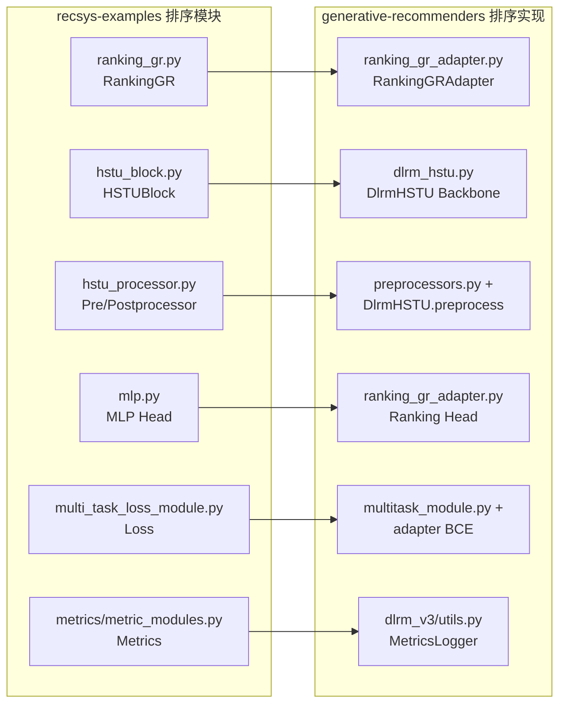
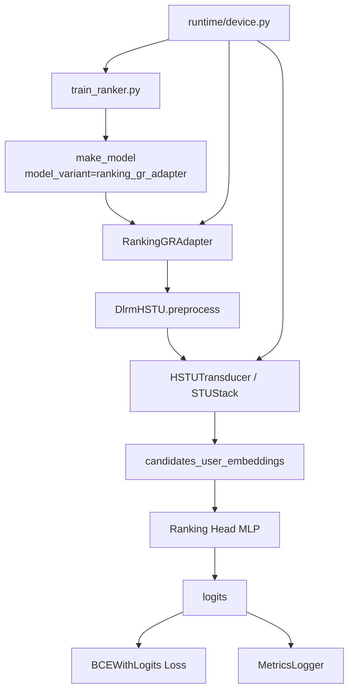

# Ranking 模块迁移与 NPU 适配文档

## 1. 目标与范围

本次适配目标是把 recsys-examples 中 RankingGR 的核心思路（序列建模 + MLP 预测头 + 多任务 BCE 训练）迁移到 generative-recommenders 架构中，并补齐 GPU 到 NPU 的运行适配。

本次改造采用“最小侵入”方案：

1. 不重写现有 DlrmHSTU 数据管线与预处理。
2. 在 DlrmHSTU 之上新增 RankingGRAdapter，替换任务头与损失逻辑。
3. 在训练入口增加 accelerator 抽象，支持 cuda / npu / cpu。
4. 去除训练主链路中 autocast 对 "cuda" 的硬编码。

## 2. 代码改动总览

### 2.1 新增文件

1. generative_recommenders/runtime/device.py
- 统一设备抽象：
  - detect_accelerator(auto/cuda/npu/cpu)
  - get_device_count
  - get_device_for_rank
  - set_current_device
  - dist_backend_for_accelerator (nccl/hccl/gloo)
  - autocast_device_type
  - can_use_bf16

2. generative_recommenders/runtime/__init__.py
- 设备工具导出。

3. generative_recommenders/modules/ranking_gr_adapter.py
- 新增 RankingGRAdapter：
  - 复用 DlrmHSTU 作为 backbone。
  - 新增可配置 MLP ranking head。
  - 使用 BCEWithLogits 风格的多任务二分类 loss。
  - 保持与 train loop 兼容的 forward 输出接口。

4. generative_recommenders/dlrm_v3/train/gin/debug_ranking_adapter.gin
- 新增调试配置，直接启用 ranking_gr_adapter。

### 2.2 修改文件

1. generative_recommenders/dlrm_v3/train/train_ranker.py
- 新增 --accelerator 参数。
- 新增 --gin-binding 参数（可多次传入）。
- 设备不再写死 cuda:{rank}，改为 accelerator 感知。
- setup/make_optimizer_and_shard 传入 accelerator。
- 非 CUDA 时自动将 Hammer kernel 切换为 PYTORCH。
- 注册新数据集配置 debug-ranking-adapter。

2. generative_recommenders/dlrm_v3/train/utils.py
- setup 支持 accelerator，后端自动选择 nccl/hccl/gloo。
- make_model 支持 model_variant：
  - dlrm_hstu（默认）
  - ranking_gr_adapter（新增）
- make_optimizer_and_shard 增加 accelerator 参数：
  - CUDA：保留 torchrec DMP + planner 路径。
  - NPU/CPU：回退到普通 model.to(device) + dense optimizer。

3. generative_recommenders/modules/dlrm_hstu.py
- autocast("cuda") 改为 autocast(autocast_device_type(device))。
- bf16 开关增加 can_use_bf16(device) 保护。

4. generative_recommenders/modules/multitask_module.py
- autocast("cuda") 同步改为设备感知。
- bf16 开关增加 can_use_bf16(device) 保护。

## 3. 排序模块迁移设计

### 3.1 架构映射

recsys-examples 的 RankingGR 主链路：
- Embedding -> HSTUBlock -> MLP -> MultiTaskLoss

generative-recommenders 迁移后的主链路：
- DlrmHSTU preprocess + HSTUTransducer (backbone)
- RankingGRAdapter MLP head（新增）
- BCEWithLogits 多任务损失（新增）

### 3.2 RankingGRAdapter 行为

1. 输入
- 与现有训练完全一致：
  - uih_features: KeyedJaggedTensor
  - candidates_features: KeyedJaggedTensor

2. 主流程
- 调用 DlrmHSTU backbone 获取候选 user embedding。
- 使用 adapter MLP 生成每个候选的 task logits。
- 输出预测 predictions = sigmoid(logits)。
- 基于 backbone 的标签与权重计算 BCEWithLogitsLoss。

3. 输出兼容
- 保持 train loop 使用的 6 元组格式：
  - user_embeddings
  - item_embeddings
  - aux_losses (含 ranking_adapter_loss)
  - predictions
  - labels
  - weights

### 3.3 源工程与目标工程排序实现差异

下面对比 recsys-examples 中的 RankingGR 与当前 generative-recommenders 中的排序实现方式（DlrmHSTU 原始结构 + 本次新增 RankingGRAdapter）。

#### 1. 模型组织方式不同

recsys-examples：
- RankingGR 是一个完整的端到端排序模型。
- 模型内部直接包含：
  - ShardedEmbedding
  - HSTUBlock
  - MLP
  - MultiTaskLossModule
  - MetricModule

generative-recommenders：
- 原始主模型是 DlrmHSTU，更偏“通用 HSTU backbone + multitask 头”的组织方式。
- 本次迁移并没有重写整个 DlrmHSTU，而是在其上新增 RankingGRAdapter。
- 因此目标工程采用的是“backbone + adapter head”的组合结构，而不是源工程那种单体式 RankingGR。

结论：
- 源工程是排序任务专用模型。
- 目标工程是通用 backbone 上挂排序适配层。

#### 2. 输入数据接口不同

recsys-examples：
- 输入是 HSTUBatch。
- HSTUBatch 内部已经把 features、labels、candidate 数量、contextual/action/item 元信息组织好。

generative-recommenders：
- 输入拆成两个 KeyedJaggedTensor：
  - uih_features
  - candidates_features
- 标签和辅助监督信息不直接作为独立字段传入，而是通过 payload feature 在模型内部解析。

结论：
- 源工程是“batch 对象驱动”。
- 目标工程是“UIH KJT + candidate KJT 驱动”。

#### 3. Embedding 查表与并行方式不同

recsys-examples：
- 使用 ShardedEmbedding。
- 明确支持 embedding model parallel，并在 RankingGR.forward 中手动做 TP 梯度缩放修正：
  - jt_dict_grad_scaling_and_allgather
  - dmp_batch_to_tp

generative-recommenders：
- 使用 EmbeddingCollection。
- 在 preprocess 中先把 uih_features 与 candidates_features 合并成一个 merged_sparse_features，再统一查表。
- CUDA 路径下依赖 torchrec DistributedModelParallel + planner。
- NPU 路径下，本次适配回退为普通 model.to(device) + dense optimizer，不再走 torchrec 的 DMP sharding。

结论：
- 源工程并行能力更强，尤其是 TP/DP 混合训练的细节更完整。
- 目标工程当前的 NPU 适配优先保证可运行，牺牲了分布式 embedding sharding 能力。

#### 4. 序列预处理方式不同

recsys-examples：
- 预处理集中在 HSTUBlockPreprocessor / hstu_preprocess_embeddings。
- 强调：
  - item/action 交织
  - contextual 拼接
  - 生成 JaggedData
  - 统一维护 seqlen / offsets / num_candidates / contextual_seqlen

generative-recommenders：
- 预处理分散在 DlrmHSTU.preprocess、ContextualPreprocessor 和 HSTUTransducer 中。
- 重点机制包括：
  - merge_uih_candidate_feature_mapping
  - payload feature 构造
  - 时间戳拼接
  - num_candidates/max_uih_len 推断
  - 输入给 HSTUTransducer 的 seq_embeddings / seq_payloads / seq_timestamps

结论：
- 源工程的预处理更“显式”，围绕 JaggedData 组织。
- 目标工程的预处理更“语义化”，围绕 UIH/candidate/payload 组织。

#### 5. 序列主干实现不同

recsys-examples：
- 主干是 HSTUBlock。
- 支持多种 layer 实现：
  - NATIVE
  - FUSED
  - DEBUG
- 训练侧显式支持 TP/SP，并与 Megatron 深度集成。

generative-recommenders：
- 主干是 HSTUTransducer + STUStack。
- 每层对应 STULayer/STULayerConfig。
- 强调 target_aware、causal、sort_by_length 等特性。
- 更偏研究代码与通用 HSTU 组件化复用。

结论：
- 两边都属于 HSTU/序列转导范式，但工程抽象层级不同。
- 源工程更偏“大规模训练系统实现”。
- 目标工程更偏“通用序列建模组件装配”。

#### 6. 预测头实现不同

recsys-examples：
- 排序 head 很直接：
  - hidden_states -> MLP -> logits
- 输入是 HSTUBlock postprocess 后的 candidate token hidden state。

generative-recommenders 原始 DlrmHSTU：
- 先分别得到：
  - candidates_user_embeddings
  - candidates_item_embeddings
- 然后 DefaultMultitaskModule 对两者做逐元素乘法，再预测：
  - prediction_module(encoded_user_embeddings * item_embeddings)

本次 RankingGRAdapter：
- 为了贴近源工程 RankingGR，adapter 使用的是：
  - candidates_user_embeddings -> ranking_head -> logits
- 当前没有显式把 candidates_item_embeddings 再做一次乘法融合。

结论：
- 源工程的 head 更接近“对候选位 hidden state 直接分类”。
- 目标工程原生 head 更接近“user embedding 与 item embedding 匹配后再预测”。
- 当前 adapter 是向源工程行为靠拢的折中实现。

#### 7. 标签与损失定义不同

recsys-examples：
- MultiTaskLossModule 支持：
  - 多任务 BCE
  - 多分类 CE
- 如果 num_classes == num_tasks，则把整数标签按 bit 位解码。

generative-recommenders 原始 DlrmHSTU：
- 标签来自 payload_features 中的 supervision_bitmasks/watchtime。
- DefaultMultitaskModule 同时支持：
  - BINARY_CLASSIFICATION
  - REGRESSION

本次 RankingGRAdapter：
- 当前只支持二分类多任务。
- 使用 BCEWithLogitsLoss 风格计算。
- 不支持源工程中的多分类 CE 分支。

结论：
- 源工程的分类损失定义更完整。
- 目标工程原生 multitask 机制更灵活，支持回归任务。
- 当前 adapter 是面向 ranking 二分类场景的最小闭环实现。

#### 8. 训练接口与返回值不同

recsys-examples：
- RankingGR.forward 返回：
  - losses
  - (losses.detach(), logits.detach(), labels.detach(), seqlen_stats)

generative-recommenders：
- train loop 期望模型返回：
  - user_embeddings
  - item_embeddings
  - aux_losses
  - predictions
  - labels
  - weights

本次 adapter 已按目标工程训练接口对齐，而不是强行保留源工程原始返回格式。

结论：
- 迁移时真正需要适配的不只是模型结构，还有训练循环契约。

#### 9. 指标体系不同

recsys-examples：
- 使用 get_multi_event_metric_module。
- 常见指标包括 AUC、ACC、Recall、Precision、F1、AP。

generative-recommenders：
- 使用 MetricsLogger + torchrec RecMetricComputation。
- 常见指标包括：
  - Accuracy
  - GAUC
  - NE
  - MSE/MAE（若是回归任务）

结论：
- 两边指标体系并不完全一致。
- 迁移后训练指标口径以 generative-recommenders 的 MetricsLogger 为准。

#### 10. GPU 与 NPU 适配方式不同

recsys-examples：
- 代码大量绑定 CUDA / Megatron / Triton / Fused kernel。
- 更适合 GPU 集群训练。

generative-recommenders：
- 原始实现同样偏 CUDA/Triton，但本次已补充：
  - accelerator 抽象
  - hccl backend 支持
  - autocast 设备自适应
  - 非 CUDA 自动 fallback 到 HammerKernel.PYTORCH

结论：
- 源工程在 GPU 上更完整。
- 目标工程经过本次改造后，在 NPU 上具备基础训练可运行性，但性能路径仍以保守兼容为主。

### 3.4 差异对迁移实现的直接影响

由于上述差异，迁移时做了以下取舍：

1. 不直接搬运 RankingGR 源码
- 因为目标工程的数据接口、训练循环契约、HSTU 主干封装方式均不同。

2. 复用 DlrmHSTU backbone
- 这样可以最小化对 generative-recommenders 现有数据管线的破坏。

3. 在 head 层模拟源工程排序语义
- 用 RankingGRAdapter 复刻 “candidate hidden state -> MLP -> BCE” 的思路。

4. NPU 优先保证正确性与可运行性
- 暂不保留源工程那套 TP/DP 混合并行优化路径。

5. 当前功能边界明确
- 已适配二分类 ranking 主链路。
- 尚未完全对齐源工程的多分类 CE、TP/SP、融合 kernel 路径。

### 3.5 迁移映射表

下表给出“源工程模块 -> 目标工程模块”的对应关系，便于按文件逐项迁移和排查。

| 迁移主题 | recsys-examples | generative-recommenders | 当前适配策略 |
|---|---|---|---|
| 排序模型入口 | examples/hstu/model/ranking_gr.py | generative_recommenders/modules/ranking_gr_adapter.py | 新增 adapter，对齐目标工程训练接口 |
| HSTU 主干容器 | examples/hstu/modules/hstu_block.py | generative_recommenders/modules/hstu_transducer.py + modules/stu.py | 复用目标工程原生主干，不直接搬源码 |
| 序列预处理 | examples/hstu/modules/hstu_processor.py | generative_recommenders/modules/preprocessors.py + DlrmHSTU.preprocess | 保留目标工程 payload/UIH/candidate 语义 |
| Embedding 查表 | examples/commons/modules/embedding.py | torchrec EmbeddingCollection in modules/dlrm_hstu.py | CUDA 保留原路；NPU 回退非 sharding 训练 |
| 变长序列结构 | modules/jagged_data.py | KeyedJaggedTensor + payload tensors | 不引入 JaggedData，沿用目标工程组织方式 |
| 排序预测头 | examples/hstu/modules/mlp.py | ranking_gr_adapter.py::_ranking_head | 新增可配置 MLP head |
| 多任务损失 | examples/hstu/modules/multi_task_loss_module.py | modules/multitask_module.py + adapter 内 BCE loss | 当前只对齐二分类 ranking |
| 排序指标 | examples/hstu/modules/metrics/metric_modules.py | dlrm_v3/utils.py::MetricsLogger | 指标口径切换为目标工程现有体系 |
| 训练入口 | examples/hstu/training/pretrain_gr_ranking.py | dlrm_v3/train/train_ranker.py | 增加 model_variant + accelerator |
| 并行训练 | Megatron TP/SP + DMP | torchrec DMP / 普通单机模型 | NPU 下优先保证可运行，暂不保留 TP/SP |
| GPU 设备逻辑 | 大量固定 CUDA | runtime/device.py | 新增 cuda/npu/cpu 统一抽象 |
| CUDA/Triton 内核 | fused/native HSTU kernels | HammerKernel/TRITON 路径 | 非 CUDA 自动 fallback 到 PYTORCH |

### 3.6 迁移对照图

#### 图 1：模块迁移对照



#### 图 2：迁移后的排序调用链



### 3.7 建议的迁移阅读顺序

如果后续你要继续增强适配，建议按下面顺序阅读和改造：

1. 先看源工程排序主流程
- examples/hstu/model/ranking_gr.py

2. 再看目标工程 backbone 输入输出
- generative_recommenders/modules/dlrm_hstu.py

3. 再看当前 adapter 是如何桥接的
- generative_recommenders/modules/ranking_gr_adapter.py

4. 然后看训练入口如何接模型
- generative_recommenders/dlrm_v3/train/utils.py
- generative_recommenders/dlrm_v3/train/train_ranker.py

5. 最后再处理 NPU 设备和 kernel fallback
- generative_recommenders/runtime/device.py

这个顺序的好处是：先理解“语义映射”，再处理“工程接线”，最后处理“设备兼容”。

## 4. NPU 适配策略

### 4.1 设备选择

通过 --accelerator 控制：
- auto: 优先 cuda，其次 npu，最后 cpu
- cuda: 强制 GPU
- npu: 强制 NPU
- cpu: 强制 CPU

### 4.2 分布式后端

自动映射：
- cuda -> nccl
- npu -> hccl
- cpu -> gloo

### 4.3 Kernel 路径切换

非 CUDA 下自动执行：
- model.set_hammer_kernel(HammerKernel.PYTORCH)

这样避免 Triton/CUDA 专用 kernel 在 NPU 上报错。

### 4.4 Autocast 兼容

将固定的 autocast("cuda") 改成设备类型自适应，避免 NPU 环境因 device type 不匹配导致异常。

## 5. 运行方法

## 5.1 CUDA（保持原模型）

```bash
python -m generative_recommenders.dlrm_v3.train.train_ranker \
  --dataset debug \
  --mode train \
  --accelerator cuda
```

## 5.2 NPU（启用 Ranking Adapter）

```bash
python -m generative_recommenders.dlrm_v3.train.train_ranker \
  --dataset debug-ranking-adapter \
  --mode train \
  --accelerator npu
```

## 5.3 不改 gin 文件，命令行覆盖为 Ranking Adapter

```bash
python -m generative_recommenders.dlrm_v3.train.train_ranker \
  --dataset debug \
  --mode train \
  --accelerator npu \
  --gin-binding "make_model.model_variant='ranking_gr_adapter'" \
  --gin-binding "make_model.ranking_prediction_head_arch=(512,1)"
```

## 6. 依赖与环境要求（NPU）

NPU 路径通常需要（以 Ascend 为例）：

1. 安装对应版本 PyTorch + torch_npu。
2. 安装并配置 HCCL 通信环境。
3. 设置 NPU 运行相关环境变量（如 ASCEND_VISIBLE_DEVICES）。

注意：具体版本组合需按你的昇腾软件栈版本匹配。

## 7. 已知限制

1. torchrec DMP planner 在 NPU 上通常不可用或不稳定。
- 本次已在非 CUDA 路径回退为普通模型训练（不做 DMP sharding）。

2. 某些底层算子仍是 CUDA 定制实现。
- 本次通过 HammerKernel.PYTORCH 规避了训练主链路中的 Triton/CUDA 依赖。
- 若后续启用未覆盖分支，仍需继续替换对应算子实现。

3. 当前 RankingGRAdapter 仅支持二分类多任务。
- 与 recsys-examples RankingGR 的主流使用场景一致。
- 如需多分类 CE，可在 adapter 中扩展 loss 分支。

## 8. 验证建议

建议按以下顺序验证：

1. CPU smoke test
- --accelerator cpu + debug-ranking-adapter，确认流程可跑通。

2. 单卡 NPU
- --accelerator npu，先 10~100 个 batch 验证 loss 与 metrics 输出。

3. 多卡 NPU
- 配置 WORLD_SIZE 后验证 HCCL 通信与稳定性。

4. 精度对比
- 在同一小数据集上对比 DlrmHSTU 原头与 RankingAdapter 头的训练曲线。

## 9. 后续可选增强

1. 将 RankingAdapter 的 loss 扩展为 BCE/CE 双模式，与 recsys-examples 对齐。
2. 在 NPU 路径引入分布式 embedding 的替代实现（替代 torchrec DMP）。
3. 增加单元测试：
- adapter 输出 shape/类型检查
- npu/cpu autocast 路径检查
- model_variant 的 gin 参数化测试

## 10. Ascend 910 单机多卡启动脚本

仓库已新增脚本：

- run_ranking_npu_ascend910.sh

脚本功能：

1. 自动加载 Ascend 环境（若存在 /usr/local/Ascend/ascend-toolkit/set_env.sh）。
2. 自动设置 WORLD_SIZE/RANK_SIZE/ASCEND_VISIBLE_DEVICES。
3. 默认以 NPU 模式启动 ranking adapter 训练。
4. 自动写日志到 logs/ranking_npu_时间戳/train.log。

### 10.1 授权与运行

```bash
cd /path/to/generative-recommenders
chmod +x run_ranking_npu_ascend910.sh
```

默认（8 卡 + ranking adapter + train）：

```bash
bash run_ranking_npu_ascend910.sh
```

指定卡数/数据集/模式：

```bash
bash run_ranking_npu_ascend910.sh 8 debug-ranking-adapter train
```

如果你希望复用旧配置并通过 gin 覆盖为 ranking adapter，也可改成：

```bash
python -m generative_recommenders.dlrm_v3.train.train_ranker \
  --dataset debug \
  --mode train \
  --accelerator npu \
  --gin-binding "make_model.model_variant='ranking_gr_adapter'" \
  --gin-binding "make_model.ranking_prediction_head_arch=(512,1)"
```

## 11. NPU 常见问题与排查

### 11.1 报错 Requested NPU accelerator but NPU is unavailable

说明 torch_npu 未安装或 Ascend 运行时未生效。

检查项：

1. python -c "import torch; print(hasattr(torch,'npu'))"
2. python -c "import torch; print(torch.npu.is_available())"
3. 是否已 source /usr/local/Ascend/ascend-toolkit/set_env.sh

### 11.2 报错 distributed backend hccl 初始化失败

检查项：

1. WORLD_SIZE 与 ASCEND_VISIBLE_DEVICES 数量一致。
2. 单机多卡时每卡可见且驱动状态正常。
3. 先尝试 1 卡：

```bash
bash run_ranking_npu_ascend910.sh 1 debug-ranking-adapter train
```

### 11.3 训练过程中触发 CUDA/Triton 相关报错

当前代码已在非 CUDA 路径自动设置 HammerKernel.PYTORCH；若仍报错，通常是某个分支仍调用了 CUDA 专用算子。

排查建议：

1. 在日志中定位 first error stack。
2. 检查是否绕过了 train_ranker.py 入口（如果绕过，可能未执行 kernel fallback）。
3. 用 debug-ranking-adapter 先跑通，再逐步打开自定义分支。

### 11.4 如何确认当前运行在 ranking adapter

方式 1：使用数据集别名 debug-ranking-adapter。

方式 2：显式 gin 绑定：

```bash
--gin-binding "make_model.model_variant='ranking_gr_adapter'"
```
